# kjlMakie

Makie theme for light/dark mode, as well as some commonly used utility functions. Mostly tested/intended for 2D vector plotting (`CairoMakie`) in half-width journal formatting (ie text sizes are sized to be legible in half-width format). Will most likely not work with the `WGLMakie` backend.

The two available themes are `kjl_light` and `kjl_dark`.

3D plots are set up without spines, axes, or labels. When required, use `labelize!(axis)` to toggle them on/off.

Background colours are all set to transparent to allow for placement in non-white/non-black scenarios. `GLMakie` requires a non-transparent background colour for the figure to render properly. Make sure to use `Figure(backgroundcolor = :color)` if working in `GLMakie`.

# Examples using kjlMakie
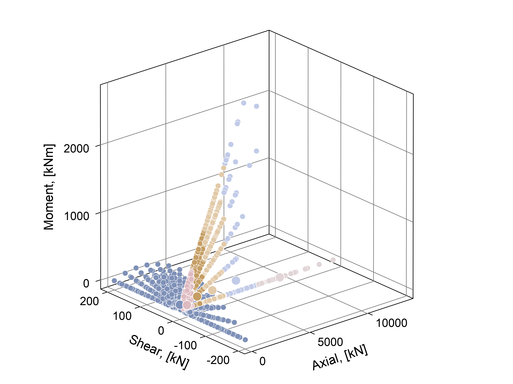

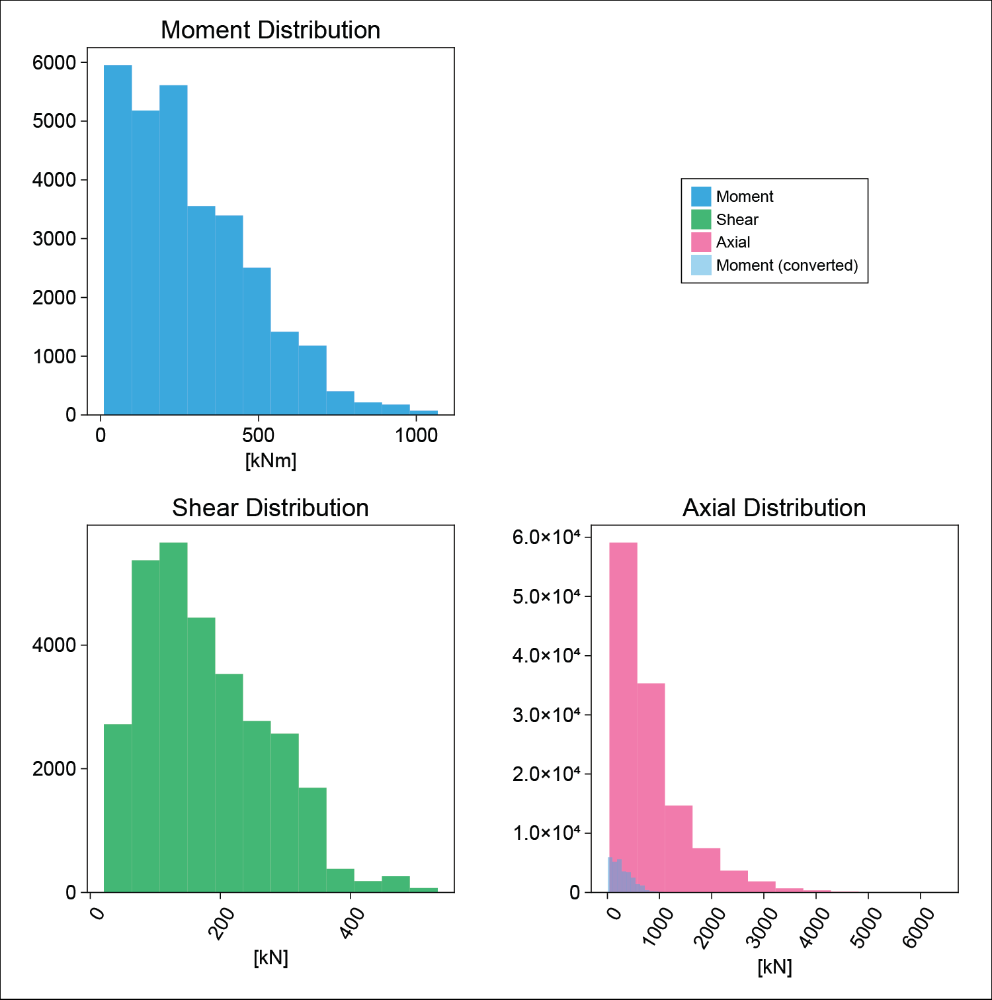

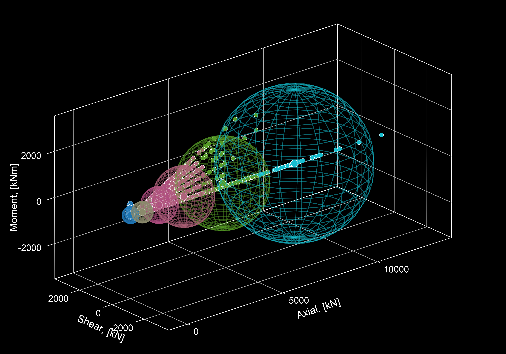

# to install

`]add https://github.com/keithjlee/kjlMakie`

then: `using kjlMakie, CairoMakie`

and either:

`set_theme!(kjl_light)`

or 

`with_theme(kjl_light) do:`

# Useful functions
## Colour-based functions
`discretize` chops up a colormap into n discrete units to reference later. This is useful when plotting categorical data using a given color gradient. The output is a vector of colours that can be indexed. The default colormap is `:tempo`.

```
colorscale = discretize(10)

colorscale2 = discretize(10, colormap = :inferno)

lines(x, color = colorscale[2])
```

## Axis modification functions
These functions work on `Axis, Axis3`.

`labelize!(axis)` turns on/off the labels/decorations of an axis.

`labelscale!(axis, factor::Float64)` scales all text/numbers by a factor (1.0 = 100% = no change). 

`resetlabelscale!(axis)` resets text/number sizes to default; equivalent to `labelscale!(axis, 1)`

`changefont!(axis)` changes the font family (default = Arial).

```
changefont!(myaxis, "Times New Roman")
```

`gridtoggle!(axis)` turns gridlines on/off.

# Walkthrough
Starting with a figure definition:
```
using CairoMakie, kjlMakie
set_theme!(kjl_dark)

fig = Figure(backgroundcolor = :black)
```


Define a 2D axis:
```
ax = Axis(fig[1,1],
        aspect = 1,
        xlabel = "t",
        ylabel = "sin(t)",
        title = "2D Plot")
```

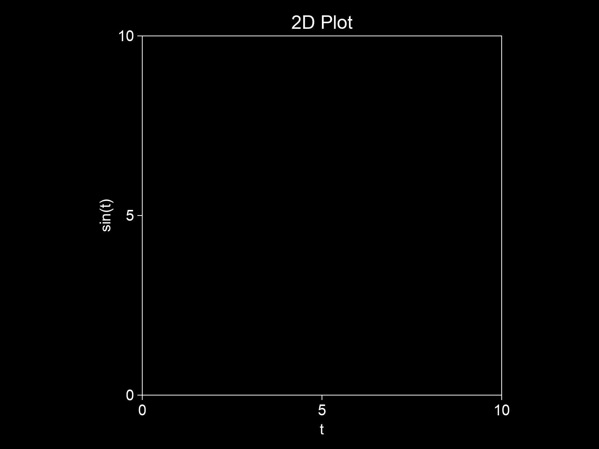

Plot a sine wave:
```
t = collect(0:0.01:2pi)
s = sin.(t)

sinwave = lines!(t, s,
    linewidth = 4)
```

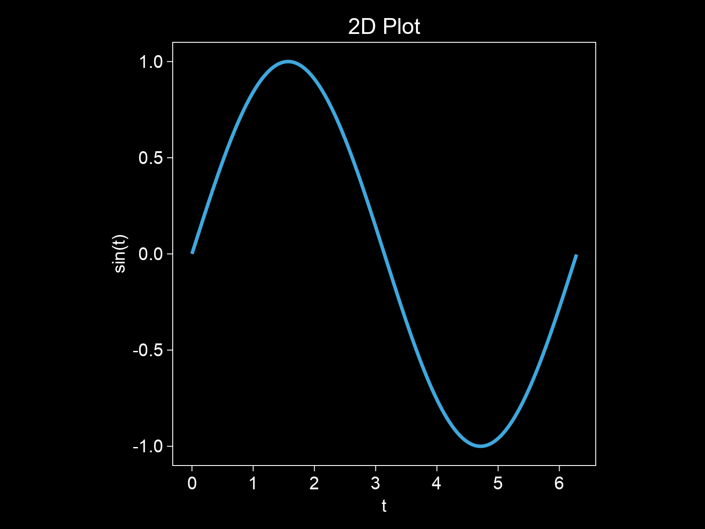

Add a new 3D axis. Note that `ax2.protusions` need to be manually set when an `Axis3` is placed next to an `Axis` to ensure zlabel text does not overlap. By default, `Axis3` blocks using kjlMakie has no spines/labels (for plotting 3d objects). `labelize!` turns these labels on, and `gridtoggle!` turns off the grid.
```
ax2 = Axis3(fig[1,2],
        xlabel = "ϕ",
        ylabel = "t",
        zlabel = "sin(t + ϕ)",
        aspect = (1,1,1))

    ax2.protrusions = 65

    labelize!(ax2)
    gridtoggle!(ax2)
```
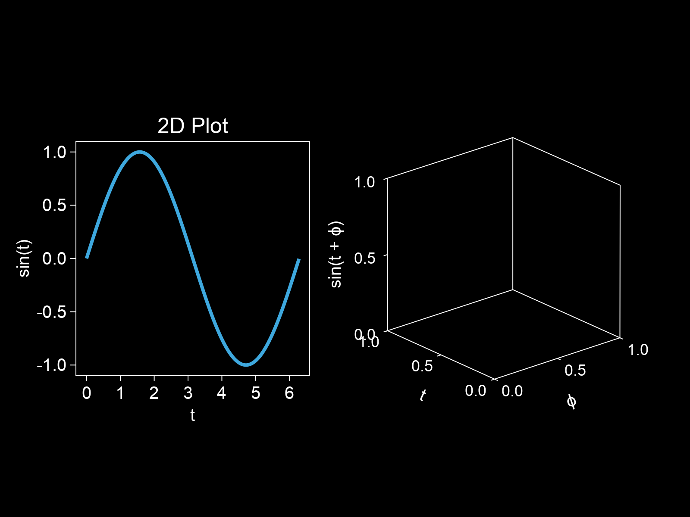

Plot phase shifted sine waves. Create a discrete colorscale using `discretize`:
```
phirange = range(0, pi/2, 7)

n = length(t)

colorscale = discretize(length(phirange), colormap = white2blue)

for (color, ϕ) in zip(colorscale, phirange)
    lines!(repeat([ϕ], n), t, sin.(t .+ ϕ),
        color = color,
        linewidth = 4) 
end
```
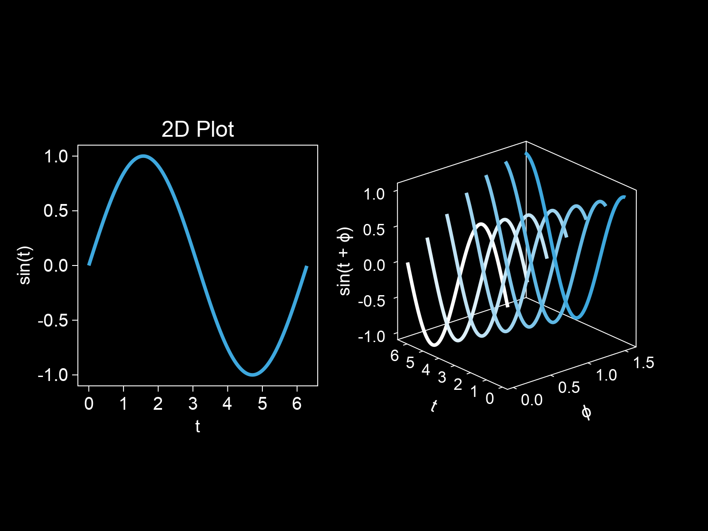

Create a third 2D axis below existing figures, and plot the summed phase shifted lines. Reset the protrusions on the 3D plot.
```
ax3 = Axis(fig[2, :],
        xlabel = "t",
        ylabel = "∑sin(t+ϕ)",
        title = "Combined")

summed = sum([sin.(t .+ ϕ) for ϕ in phirange])

lines!(t, summed,
    color = summed,
    linewidth = 8,
    colormap = white2blue)

ax2.protrusions = 0
```
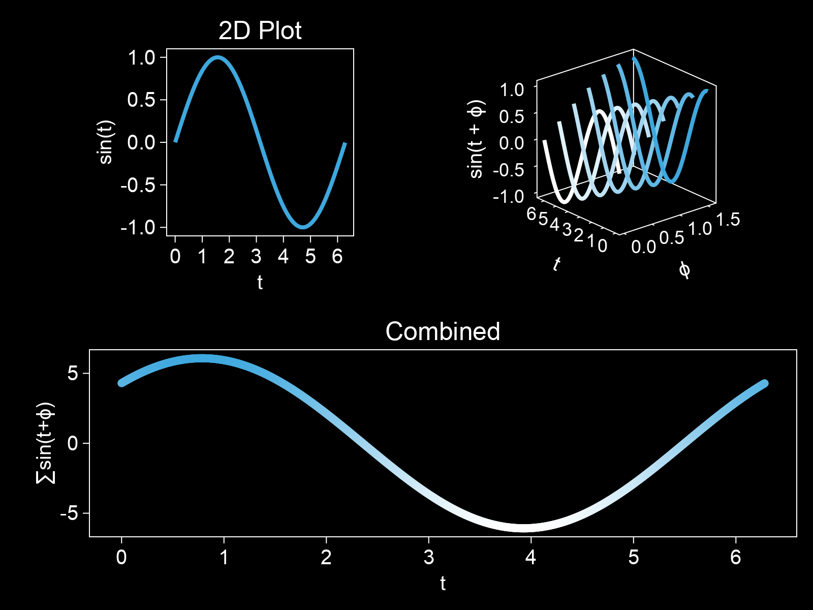

Use `gridtoggle!` to turn on the grid for the latest plot:
```
gridtoggle!(ax3)
```


Scale the text size on the first plot:
```
labelscale!(ax, 0.75)
```
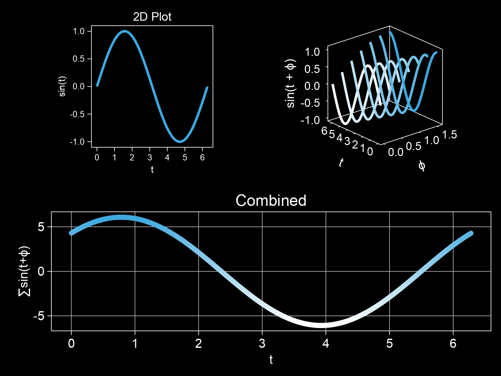

Turn off the decorations for the last plot:
```
labelize!(ax2)
gridtoggle!(ax2)
```
Equivalent to the built-in functions:
```
hidedecorations!(ax2)
hidespines!(ax2)
```
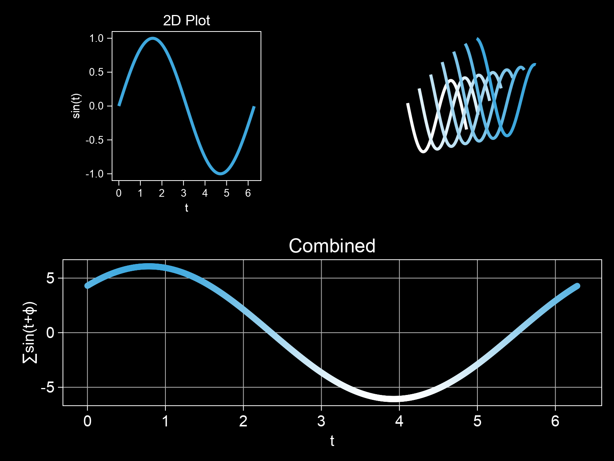

And a fun lil animation to show how nice `Makie` + `kjlMakie` is :)
```
iterator = collect(0:360)
inc = 2pi / 360

record(fig, "figures/anim.gif", iterator; framerate = 20) do _
    ax2.azimuth[] += inc
end
```
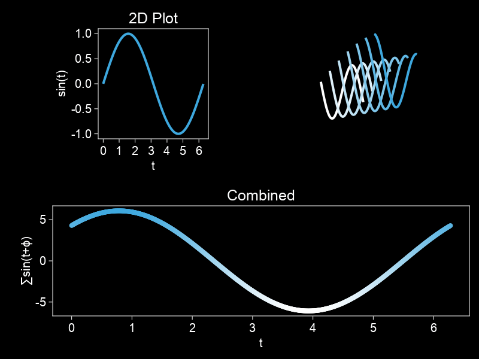