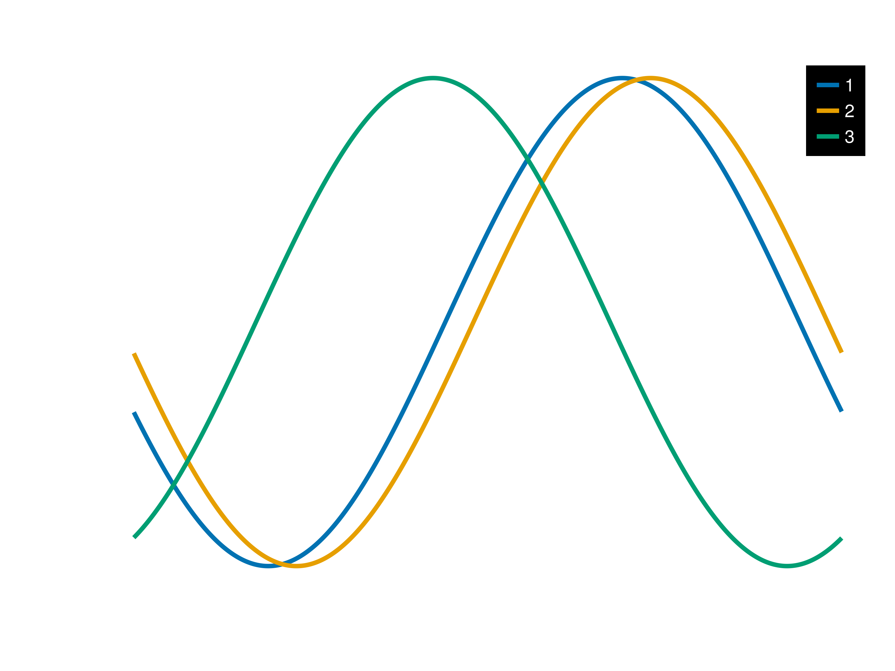

# kjlMakie

Makie theme for light/dark mode, as well as some commonly used utility functions. Mostly tested/intended for 2D vector plotting (`CairoMakie`) in half-width journal formatting (ie text sizes are sized to be legible in half-width format). Will most likely not work with the `WGLMakie` backend.

The two available themes are `kjl_light` and `kjl_dark`.

3D plots are set up without spines, axes, or labels. When required, use `labelize!(axis)` to toggle them on/off.

Background colours are all set to transparent to allow for placement in non-white/non-black scenarios. `GLMakie` requires a non-transparent background colour for the figure to render properly. Make sure to use `Figure(backgroundcolor = :color)` if working in `GLMakie`.

# to install

`]add https://github.com/keithjlee/kjlMakie`

then: `using kjlMakie, CairoMakie`

and either:

`set_theme!(kjl_light)`

or 

`with_theme(kjl_light) do:`

# Useful functions
`discretize` chops up a colormap into n discrete units to reference later. The default colormap is `:tempo`.

```
colorscale = discretize(10)

colorscale2 = discretize(10, colormap = :inferno)
```

`labelize!(axis::Union{Axis, Axis3})` turns on/off the labels/decorations of an axis.

`labelscale!(axis::Union{Axis, Axis3})` scales all text/numbers by a factor (1.0 = 100% = no change).

`resetlabelscale!(axis::Union{Axis,Axis3})` resets text/number sizes to default.

`changefont!(axis::Union{Axis,Axis3}, font::String)` changes the font family (default = Arial).

```
changefont!(myaxis, "Times New Roman")
```

`gridtoggle!(axis::Union{Axis, Axis3})` turns gridlines on/off.
